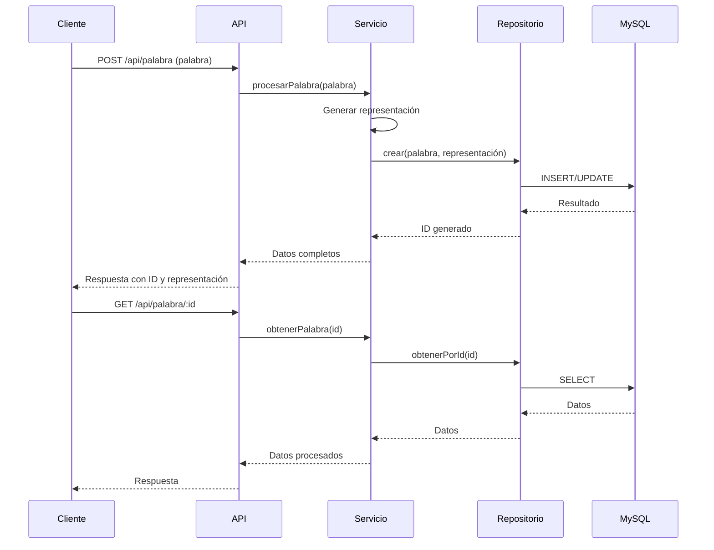

# Design Document

## Overview

Este documento describe el diseño técnico para integrar una base de datos MySQL con la API de palabras en asteriscos existente. La integración permitirá almacenar, recuperar y gestionar las palabras procesadas por la API.

## Arquitectura

La arquitectura seguirá el patrón MVC (Modelo-Vista-Controlador) existente, añadiendo una capa de acceso a datos para interactuar con MySQL:

```
+----------------+     +----------------+     +----------------+     +----------------+
|                |     |                |     |                |     |                |
|  Controllers   | --> |   Services     | --> |  Repositories  | --> |    Database    |
|                |     |                |     |                |     |    (MySQL)     |
+----------------+     +----------------+     +----------------+     +----------------+
```

- **Controllers**: Manejan las peticiones HTTP y devuelven respuestas.
- **Services**: Contienen la lógica de negocio.
- **Repositories**: Proporcionan una abstracción para el acceso a datos.
- **Database**: MySQL donde se almacenarán los datos.

## Componentes e Interfaces

### 1. Modelo de Datos

#### Tabla `palabras`

| Campo          | Tipo          | Descripción                                   |
|----------------|---------------|-----------------------------------------------|
| id             | INT           | Identificador único (clave primaria)          |
| palabra        | VARCHAR(255)  | La palabra original                           |
| representacion | TEXT          | Representación en asteriscos                  |
| contador_uso   | INT           | Número de veces que se ha solicitado          |
| fecha_creacion | DATETIME      | Fecha y hora de la primera creación           |
| ultima_consulta| DATETIME      | Fecha y hora de la última consulta            |

### 2. Componentes de Software

#### 2.1 Configuración de Base de Datos

Se creará un módulo de configuración para gestionar la conexión a MySQL:

```javascript
// src/config/database.js
const mysql = require('mysql2/promise');

const pool = mysql.createPool({
  host: process.env.DB_HOST || 'localhost',
  user: process.env.DB_USER || 'root',
  password: process.env.DB_PASSWORD || 'fantasma',
  database: process.env.DB_NAME || 'palabras_db',
  waitForConnections: true,
  connectionLimit: 10,
  queueLimit: 0
});

module.exports = pool;
```

#### 2.2 Repositorio de Palabras

Se creará un repositorio para encapsular las operaciones de base de datos:

```javascript
// src/repositories/palabrasRepository.js
const pool = require('../config/database');

class PalabrasRepository {
  async crear(palabra, representacion) {
    // Implementación
  }
  
  async obtenerPorId(id) {
    // Implementación
  }
  
  async listar(pagina, limite) {
    // Implementación
  }
  
  async buscar(filtro) {
    // Implementación
  }
  
  async actualizar(id, datos) {
    // Implementación
  }
  
  async eliminar(id) {
    // Implementación
  }
  
  async obtenerEstadisticas() {
    // Implementación
  }
}

module.exports = new PalabrasRepository();
```

#### 2.3 Servicio de Palabras

Se creará un servicio para manejar la lógica de negocio:

```javascript
// src/services/palabrasService.js
const palabrasRepository = require('../repositories/palabrasRepository');
const alfabetoPalabras = require('../helpers/Alfabeto');

class PalabrasService {
  async procesarPalabra(palabra) {
    // Implementación que usa el helper existente y guarda en BD
  }
  
  async obtenerPalabra(id) {
    // Implementación
  }
  
  // Otros métodos
}

module.exports = new PalabrasService();
```

#### 2.4 Controladores

Se extenderán los controladores existentes y se crearán nuevos:

```javascript
// src/controllers/palabrasController.js (extendido)
const palabrasService = require('../services/palabrasService');

// Método existente modificado
const PalabraEnAsteriscos = async (req, res) => {
  // Implementación modificada para usar el servicio
};

// Nuevos métodos
const obtenerPalabra = async (req, res) => {
  // Implementación
};

const listarPalabras = async (req, res) => {
  // Implementación
};

// Otros métodos

module.exports = { 
  PalabraEnAsteriscos,
  obtenerPalabra,
  listarPalabras,
  // Otros métodos
};
```

#### 2.5 Rutas

Se extenderán las rutas existentes:

```javascript
// src/routes/palabras.js (extendido)
const express = require('express');
const router = express.Router();
const { 
  PalabraEnAsteriscos, 
  obtenerPalabra,
  listarPalabras,
  // Otros métodos
} = require('../controllers/palabrasController');

// Ruta existente
router.post('/palabra', PalabraEnAsteriscos);

// Nuevas rutas
router.get('/palabra/:id', obtenerPalabra);
router.get('/palabras', listarPalabras);
// Otras rutas

module.exports = router;
```

### 3. Inicialización de la Base de Datos

Se creará un script para inicializar la base de datos:

```javascript
// src/config/initDb.js
const pool = require('./database');

async function initializeDatabase() {
  try {
    const connection = await pool.getConnection();
    
    // Crear tabla si no existe
    await connection.query(`
      CREATE TABLE IF NOT EXISTS palabras (
        id INT AUTO_INCREMENT PRIMARY KEY,
        palabra VARCHAR(255) NOT NULL,
        representacion TEXT NOT NULL,
        contador_uso INT DEFAULT 1,
        fecha_creacion DATETIME DEFAULT CURRENT_TIMESTAMP,
        ultima_consulta DATETIME DEFAULT CURRENT_TIMESTAMP,
        UNIQUE KEY (palabra)
      )
    `);
    
    console.log('Base de datos inicializada correctamente');
    connection.release();
  } catch (error) {
    console.error('Error al inicializar la base de datos:', error);
    throw error;
  }
}

module.exports = { initializeDatabase };
```

## Manejo de Errores

Se implementará un middleware para manejar errores de forma centralizada:

```javascript
// src/middlewares/errorHandler.js
const errorHandler = (err, req, res, next) => {
  console.error(err.stack);
  
  const statusCode = err.statusCode || 500;
  const message = err.message || 'Error interno del servidor';
  
  res.status(statusCode).json({
    error: message,
    stack: process.env.NODE_ENV === 'development' ? err.stack : undefined
  });
};

module.exports = errorHandler;
```

## Estrategia de Pruebas

### Pruebas Unitarias

Se implementarán pruebas unitarias para cada componente utilizando Jest:

- Pruebas para el repositorio con un mock de la base de datos
- Pruebas para el servicio con un mock del repositorio
- Pruebas para los controladores con mocks del servicio

### Pruebas de Integración

Se implementarán pruebas de integración para verificar la interacción entre componentes:

- Pruebas de integración entre el servicio y el repositorio con una base de datos de prueba
- Pruebas de API end-to-end utilizando Supertest

## Consideraciones de Seguridad

- Uso de consultas parametrizadas para prevenir inyecciones SQL
- Validación de entrada para todos los parámetros de usuario
- Uso de variables de entorno para credenciales de base de datos
- Implementación de rate limiting para prevenir abusos

## Diagrama de Flujo

